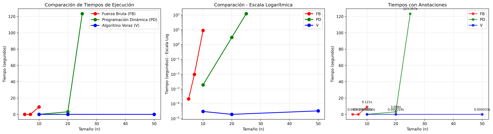

## ¿Qué es este Benchmark?

Como tal este benchmark compara el rendimiento de los tres algoritmos usados:
- Fuerza Bruta
- Voraz
- Dinamico

El archivo `benchmark.py` ejecuta los siguientes pasos:

1. **Genera fincas aleatorias** de diferentes tamaños (n) usando `generar_finca_aleatoria(n)` de utils.py
2. **Ejecuta cada algoritmo** con tamaños de entrada específicos:
   - FB: n = 5, 7, 10 (Ya que directamente con fincas mas grandes debido a su complejidad es exageradamente tardio su analisis)

   - PD: n = 10, 20, 25

   - V: n = 10, 20, 50

3. **Mide el tiempo de ejecución** usando `time.time()` antes y después de cada algoritmo

4. **Genera visualizaciones** comparativas de los resultados.

Para hacer una comparacion correcta entre funcionabilidad y tardanza, se comparara en la resolucion en donde son similes: Para 10 tablones.

## Análisis de Resultados

### Gráfica 1: Crecimiento de Complejidad Computacional

Esta gráfica muestra claramente cómo escala cada algoritmo:

#### Fuerza Bruta (Rojo - FB)
- **Complejidad:** $O(n \times n!)$
- Crece de forma exponencial.
- A n=10, toma ~9 segundos
- Inaplicable para n > 10

#### Programación Dinámica (Verde - PD)
- **Complejidad:** $O(n \times 2^n)$
- Crece exponencialmente pero mas controlado que FB
- A n=10, toma ~0.002 segundos
- A n=25, explota a ~129 segundos
- **Viable** hasta n≈25

#### Algoritmo Voraz (Azul - V)
- **Complejidad:** $O(n \times \log n)$
- Crece de forma casi lineal
- A n=50, toma solo ~0.0003 segundos
- Altamente escalable

### Grafico 2: Comparación Detallada

#### Panel Izquierdo: Comparación Directa
Muestra los tres algoritmos en escala normal. Se observa que:
- FB y PD dominan visualmente el gráfico por sus tiempos altos
- V es exageradamente rapido comparado con los otros dos, casi inmediatamente cercano al eje x.

#### Panel Central: Escala Logarítmica
Se usa la escala logarítmica en el eje Y para visualizar mejor todos los algoritmos:
- Muestra la diferencia relativa entre FB y PD claramente
- FB: desde 10⁻⁴ hasta 10¹ segundos
- PD: desde 10⁻³ hasta 10² segundos
- V: permanece constante alrededor de 10⁻⁵ segundos

#### Panel Derecho: Tiempos con Anotaciones
Incluye los valores exactos sobre cada punto:
- FB a n=10: 8.809s
- PD a n=25: 129.194s
- V a n=50: 0.000030s

## Conclusiones Clave

### Eficiencia Comparativa

| Algoritmo | n=10 | Escalabilidad | Uso Recomendado |
|-----------|------|---------------|-----------------|
| FB | 8.8s | Muy baja | Solo para n ≤ 10 |
| PD | 0.002s | Media | Problemas pequeños-medianos (n ≤ 25) |
| V | 0.00002s | Excelente | Problemas grandes (n > 50) |